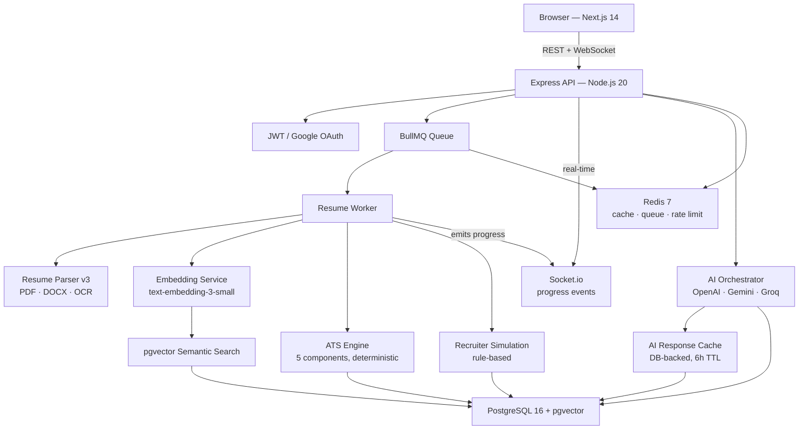

<h1 align="center">
  Resumora
</h1>

<p align="center">
  <strong>AI-powered resume analysis platform — ATS scoring, job matching, and recruiter simulation in one production-grade application.</strong>
</p>

<p align="center">
  <a href="https://github.com/mrinali123/Resumora/actions/workflows/ci.yml">
    
  </a>
  
  
  
  
  
  
  
</p>

<p align="center">
  <a href="https://resumora-pink.vercel.app"><strong>Live Demo →</strong></a>
  &nbsp;&nbsp;|&nbsp;&nbsp;
  <a href="https://resumora-backend.onrender.com/api/docs"><strong>API Docs →</strong></a>
</p>

---

Most resume tools are black boxes. Resumora is different: it gives candidates a **transparent, deterministic ATS score** (no LLM guesswork), simulates how a recruiter actually reads a CV, matches against real job descriptions, and provides AI-powered improvement suggestions — all backed by a production-grade async pipeline with real-time progress, semantic search, and multi-provider AI failover.

---

## Live Demo

| Service | URL |
|---|---|
| **Frontend** | [resumora-pink.vercel.app](https://resumora-pink.vercel.app) |
| **Backend API** | [resumora-backend.onrender.com](https://resumora-backend.onrender.com) |
| **API Docs (Swagger)** | `/api/docs` in development |

> The backend runs on Render's free tier — the first request may take ~30 s to wake the instance.

---

## Features

### Resume Processing

| Feature | Details |
|---|---|
| **Multi-format upload** | PDF and DOCX (magic-byte validated, 10 MB limit) |
| **OCR fallback** | Tesseract.js + pdfjs-dist auto-detects and OCRs scanned PDFs |
| **Parsing pipeline v3** | Section detection → regex extractors → confidence scoring → LLM cleanup when confidence < 0.60 |
| **Semantic chunking** | Section-aware chunks (SKILLS, EXPERIENCE, EDUCATION, PROJECTS …) with token estimates |
| **Vector embeddings** | OpenAI `text-embedding-3-small` (1536-dim) stored in pgvector |
| **Async processing** | BullMQ worker; returns `202` immediately, emits real-time WebSocket progress |
| **Resume comparison** | Side-by-side diff of two resume versions with delta scoring and regression detection |
| **History feed** | Unified activity feed of all analyses and comparisons |

### ATS Analysis

| Feature | Details |
|---|---|
| **Deterministic scoring** | Five weighted components — no LLM, fully auditable |
| **Skills Match** | 40% — direct skill alignment against the job description |
| **Experience Relevance** | 25% — years, seniority, responsibility pattern matching |
| **Project Strength** | 15% — depth signal + JD-relevance bonus |
| **Formatting Quality** | 10% — structural completeness, ATS parse-success proxy |
| **Impact Metrics** | 10% — quantification and action-verb quality |
| **Grade scale** | A+ (90–100) · A (80–89) · B+ (75–79) · B (65–74) · C (50–64) · D (35–49) · F (0–34) with evidence arrays per component |
| **Recruiter simulation** | Rule-based engine: red-flag detection, strength identification, shortlist probability (0–100%), recruiter notes |
| **PDF export** | One-click jsPDF export of the full ATS report |

### AI Features

| Feature | Details |
|---|---|
| **Multi-provider** | OpenAI (primary), Google Gemini, and Groq with automatic failover |
| **Improve Resume** | Ranked enhancement suggestions with priority levels |
| **Interview Prep** | Role-specific questions + model answers |
| **Rewrite Bullets** | Transforms weak bullet points into impact-quantified statements |
| **Career Coach** | Career path guidance and next-step recommendations |
| **Learning Roadmap** | Skill roadmap with time-based milestones |
| **Learning Plan** | Weekly study schedule with resources |
| **RAG context** | Retrieved resume + job + ATS context injected into every prompt |
| **Response cache** | DB-backed 6-hour TTL — identical requests never hit the LLM twice |
| **Token metrics** | Every LLM call logged: provider, model, tokens, latency, cache hit |

### Job Matching

| Feature | Details |
|---|---|
| **JD ingestion** | Paste any job description; chunked and embedded identically to resumes |
| **Match scoring** | Overall + component scores: skills, experience, projects, keywords |
| **Gap analysis** | Missing required vs. missing preferred skills |
| **Semantic search** | pgvector cosine similarity (`<=>`) across all stored resumes and jobs |
| **Similar resumes** | Find resumes semantically close to any uploaded document |

### Authentication & Security

| Feature | Details |
|---|---|
| **Email / password** | bcrypt (12 rounds), JWT (HS256, 7-day expiry) |
| **Google OAuth** | ID-token flow via `@react-oauth/google` + `google-auth-library`; auto-links existing accounts |
| **Email verification** | SHA-256 hashed token, 24-hour expiry, 1-hour resend cooldown |
| **Password reset** | SHA-256 hashed token, 1-hour expiry |
| **Account deletion** | Password-confirmed; cascades all user data |
| **Rate limiting** | 6 independent tiers (auth, AI, upload, analysis, comparison, general) |
| **Magic-byte validation** | Server-side MIME check — client MIME type is ignored |
| **Input sanitization** | Blocks `__proto__`, `constructor`, `prototype` keys; NUL bytes; and objects deeper than 10 levels |

---

## Tech Stack

### Frontend

| Technology | Version | Purpose |
|---|---|---|
| Next.js | 14.2 | App Router, SSR, API proxy rewrites |
| React | 18 | UI framework |
| TypeScript | 5 | Type safety |
| Tailwind CSS | 3.4 | Utility-first styling |
| Framer Motion | 11 | Page and component animations |
| Three.js + React Three Fiber | 0.166 | 3D hero orb |
| Recharts | 2.12 | Score charts and radar charts |
| jsPDF | 4 | Client-side PDF export |
| Socket.io Client | 4.8 | Real-time upload progress |
| @react-oauth/google | 0.13 | Google OAuth button |
| lucide-react | 0.407 | Icons |

### Backend

| Technology | Version | Purpose |
|---|---|---|
| Node.js | 20 | Runtime |
| Express | 4.18 | HTTP framework |
| TypeScript | 5.3 | Type safety |
| Prisma | 5.7 | ORM + migrations |
| Zod | 3.22 | Schema validation on every route |
| Pino | 8 | Structured JSON logging |
| BullMQ | 5 | Async job queue |
| Socket.io | 4.8 | WebSocket server |
| express-rate-limit | 8 | Rate limiting |
| Helmet | 7 | Security headers |
| jsonwebtoken | 9 | JWT signing and verification |
| bcryptjs | 2.4 | Password hashing |
| google-auth-library | 10 | Google ID token verification |
| multer | 2 | File upload |
| mammoth | 1.12 | DOCX text extraction |
| pdf-parse | 1.1 | PDF text extraction |
| Tesseract.js | — | OCR for scanned PDFs |
| swagger-ui-express | 5 | OpenAPI/Swagger docs |

### Database & Infrastructure

| Technology | Purpose |
|---|---|
| PostgreSQL 16 | Primary relational database |
| pgvector | 1536-dim vector similarity search |
| Redis 7 | Caching, rate limiting, BullMQ queue backend |

### AI / ML

| Provider | Models | Role |
|---|---|---|
| OpenAI | `gpt-4o-mini`, `text-embedding-3-small` | Primary LLM + all embeddings |
| Google Gemini | `gemini-1.5-flash` | LLM failover |
| Groq | `llama-3.3-70b-versatile` | LLM failover |

### Deployment & CI

| Tool | Purpose |
|---|---|
| Vercel | Frontend hosting |
| Render | Backend hosting |
| Docker + Compose | Multi-stage build, non-root user, healthcheck |
| GitHub Actions | 6-job CI pipeline |
| Playwright | E2E browser tests (Chromium) |
| Jest + Supertest | 251 unit + integration tests |

---

## Architecture



---

## Upload & Processing Flow

```mermaid
flowchart LR
    A([Upload PDF/DOCX]) --> B[Magic-byte validation]
    B --> C[Store file to disk]
    C --> D{Redis available?}
    D -->|Yes| E[Enqueue BullMQ job\nReturn 202 + jobId]
    D -->|No| F[Process synchronously\nReturn 201]
    E --> G[Worker picks up job]
    G --> H[Extract text\npdf-parse / Mammoth]
    H --> I{Text sparse?}
    I -->|Yes| J[OCR via Tesseract.js]
    I -->|No| K
    J --> K[Parse sections\nSkills · Exp · Edu · Projects]
    K --> L{Confidence < 0.60?}
    L -->|Yes| M[LLM cleanup pass]
    L -->|No| N[Semantic chunking]
    M --> N
    N --> O[OpenAI embeddings\n100 texts per call]
    O --> P[Store in pgvector]
    P --> Q[ATS scoring\n5 components]
    Q --> R[Recruiter simulation]
    R --> S[Persist to PostgreSQL]
    S --> T([Socket.io: resume:complete])
```



---

## Project Structure

```
resumora/
├── src/                          # Backend — Express + TypeScript
│   ├── ai/
│   │   ├── providers/            # openai.provider.ts, gemini.provider.ts, groq.provider.ts
│   │   ├── prompts/templates/    # 6 prompt files (improve-resume, interview-prep, …)
│   │   ├── cache/                # DB-backed AI response cache
│   │   └── context/              # RAG context builder
│   ├── ats-scoring/
│   │   ├── components/           # 5 individual scorers
│   │   └── pipeline.ts           # Orchestrates components, computes grade
│   ├── recruiter-sim/            # Rule-based recruiter simulation engine
│   ├── resume-comparison/        # Side-by-side resume diff service
│   ├── parser/                   # Parsing pipeline v3 entry point
│   ├── parsers/                  # pdf-parse, mammoth, OCR text extractors
│   ├── chunkers/                 # Section-aware semantic chunking
│   ├── embeddings/               # OpenAI embedding service with batching
│   ├── retrieval/                # pgvector similarity search queries
│   ├── jd-matching/              # Job description matching pipeline
│   ├── queue/workers/            # resume-processing.worker.ts, ats-analysis.worker.ts
│   ├── cache/                    # Redis cache service
│   ├── config/                   # env, database, redis, email, socket, upload
│   ├── controllers/              # Thin HTTP handlers
│   ├── services/                 # Business logic layer
│   ├── middleware/               # auth, rate-limit, validate, sanitize, error
│   ├── routes/                   # 9 Express route groups
│   ├── validators/               # Zod schemas (body + params + query)
│   ├── metrics/                  # AI token usage metrics
│   └── utils/                    # jwt, logger, errors, asyncHandler, mapper
│
├── frontend/src/
│   ├── app/                      # 20 Next.js pages
│   │   ├── page.tsx              # Home / landing
│   │   ├── login/                # Sign in
│   │   ├── register/             # Create account
│   │   ├── verify-email/         # Email verification callback
│   │   ├── forgot-password/      # Request password reset
│   │   ├── reset-password/       # Set new password
│   │   ├── dashboard/            # Main dashboard
│   │   ├── upload/               # Resume upload with real-time progress
│   │   ├── resumes/              # Resume library
│   │   ├── resumes/[id]/         # Individual resume detail
│   │   ├── analysis/             # AI feature hub
│   │   ├── ats-score/            # ATS scoring UI + PDF export
│   │   ├── job-matching/         # Job description matching
│   │   ├── recruiter/            # Recruiter simulation view
│   │   ├── comparison/           # Side-by-side resume comparison
│   │   ├── history/              # Activity feed
│   │   ├── career-coach/         # AI career coach
│   │   ├── interview-prep/       # AI interview prep
│   │   ├── learning-roadmap/     # AI skill roadmap
│   │   └── settings/             # Account settings + delete account
│   ├── components/               # Shared UI + Providers.tsx (Google OAuth wrapper)
│   ├── context/                  # Auth context
│   └── lib/                      # api-client.ts, socket.ts, export-pdf.ts
│
├── prisma/
│   ├── schema.prisma             # 12 models, pgvector column, all indexes
│   └── migrations/               # Version-controlled schema history
│
├── tests/
│   ├── unit/                     # 243 Jest unit tests
│   ├── integration/              # 8 Jest + Supertest integration tests
│   └── e2e/                      # Playwright E2E tests (Chromium)
│
├── .github/workflows/ci.yml      # 6-job CI pipeline
├── Dockerfile                    # Multi-stage build, non-root user (nodejs:1001)
├── docker-compose.yml            # pgvector/pgvector:pg16, redis:7-alpine
└── playwright.config.ts          # Chromium, 30s timeout, 1 retry in CI
```

---

## Core Engineering Details

<details>
<summary><strong>Resume Parsing Pipeline v3</strong></summary>

The parser runs in five deterministic stages before optionally invoking an LLM:

1. **Text extraction** — pdf-parse for text-based PDFs; Mammoth for DOCX
2. **OCR fallback** — if extracted text is sparse, pdfjs-dist renders each page as an image and a singleton Tesseract.js worker OCRs it (lazy-initialised to avoid startup overhead)
3. **Section detection** — heading-matching identifies CONTACT, SKILLS, EDUCATION, EXPERIENCE, PROJECTS, CERTIFICATIONS
4. **Regex extractors** — per-section structured extraction with date normalisation and skill canonicalisation
5. **Confidence scoring** — 0–1 scale based on field coverage; if below 0.60, a lightweight LLM cleanup pass fills gaps

The parser version is stored on every `ParsedResume` row, so re-parsing with a newer version is always safe.

</details>

<details>
<summary><strong>Deterministic ATS Scoring Engine</strong></summary>

ATS scores are computed entirely from regex, set arithmetic, and documented scoring curves — no LLM is involved. Every score is **reproducible and auditable**.

| Component | Weight | What it measures |
|---|---|---|
| Skills Match | 40% | Direct skill overlap with the job description |
| Experience Relevance | 25% | Years + seniority + responsibility patterns |
| Project Strength | 15% | Depth signal + JD relevance bonus |
| Formatting Quality | 10% | Structural completeness |
| Impact Metrics | 10% | Quantification + action-verb quality |

Every component returns an evidence array so the UI can explain exactly why a score was given. Grades range from A+ (90–100) down to F (0–34).

</details>

<details>
<summary><strong>Recruiter Simulation Engine</strong></summary>

A rule-based engine models how a human recruiter reads a CV. It evaluates a set of `RED_FLAG_RULES` (CRITICAL / HIGH / MEDIUM / LOW severity) and `STRENGTH_RULES` (STANDOUT / STRONG / NOTABLE), then computes a `shortlistProbability` (0–100) from a base score with per-rule penalties and boosts. Output includes a `recruiterDecision` (Reject / Maybe / Shortlist) and three-sentence `recruiterNotes` — fully deterministic, zero LLM.

</details>

<details>
<summary><strong>Multi-Provider AI with Retry and Fallback</strong></summary>

Every AI request flows through a single orchestrator:

1. **Cache check** — returns immediately on hit (DB-backed, 6-hour TTL)
2. **Primary provider** — configurable; retried with exponential backoff
3. **Fallback provider** — tried once if primary exhausts retries
4. **JSON extraction** — strips markdown code fences before parsing
5. **Async cache write + metrics** — non-blocking, fire-and-forget

Six prompt templates: improve-resume, interview-prep, rewrite-bullets, career-coach, learning-roadmap, learning-plan.

</details>

<details>
<summary><strong>Async Upload with Real-time Progress</strong></summary>

On upload the API stores the file and immediately returns `202 Accepted` with a `jobId`. A BullMQ worker emits Socket.io events to the user's private room (`user:{id}`):

```
resume:progress  { progress: 0–100, message: "Extracting text…" }
resume:complete  { resumeId }
resume:error     { message }
```

WebSocket connections require a JWT in `socket.handshake.auth.token`. If no Socket.io event arrives within 10 seconds, the frontend silently falls back to HTTP polling.

</details>

<details>
<summary><strong>Semantic Search with pgvector</strong></summary>

Resume chunks are embedded with `text-embedding-3-small` (1536 dimensions) and stored in a `vector(1536)` pgvector column. Similarity search uses the cosine distance operator (`<=>`), always scoped to the authenticated user via a JOIN through the parent resume or job table. The `findSimilarResumes` query returns results ranked by distance with a configurable minimum similarity threshold.

</details>

<details>
<summary><strong>Google OAuth — ID Token Flow</strong></summary>

The frontend uses `@react-oauth/google` (`GoogleLogin` component) which returns a signed Google ID token (`credential`). The token is POSTed to `POST /auth/google`. The backend verifies it with `google-auth-library`'s `OAuth2Client.verifyIdToken()` — no client secret is ever sent to the frontend. Three cases are handled:

1. User with matching `googleId` → issue JWT
2. User with matching email (existing account) → link `googleId`, issue JWT
3. New user → create with random password, `emailVerified: true`, issue JWT

The Google button is conditionally rendered only when `NEXT_PUBLIC_GOOGLE_CLIENT_ID` is set at build time, so CI and environments without the key see no Google-related scripts at all.

</details>

---

## Security

| Layer | Implementation |
|---|---|
| **Passwords** | bcrypt, 12 rounds |
| **JWT** | HS256, minimum 32-character secret enforced at startup, 7-day expiry |
| **Google OAuth** | ID token verified server-side; no client secret in the frontend bundle |
| **Email verification** | 32-byte random token → SHA-256 hashed before DB storage; raw token only in the URL |
| **Password reset** | Same hashed-token pattern; 1-hour expiry, single-use |
| **Rate limiting** | Auth: 10 req/15 min · AI: 20 req/h · Upload: 5 req/h · Analysis: 30 req/h · Compare: 20 req/h · General: 100 req/min |
| **File validation** | Magic-byte check (PDF: `%PDF`, DOCX: PK ZIP) — cannot be spoofed via MIME type |
| **Input sanitization** | Blocks `__proto__`, `constructor`, `prototype` keys; NUL bytes; and objects deeper than 10 levels |
| **Security headers** | Helmet: CSP, HSTS, X-Frame-Options, X-Content-Type-Options, Referrer-Policy |
| **User enumeration** | Dummy bcrypt hash compared when user doesn't exist — prevents timing attacks |
| **CORS** | `credentials: true`; wildcard `*` blocked in production at startup |
| **Zod validation** | Body, params, and query validated on every route before the handler runs |
| **WebSocket auth** | JWT required in `socket.handshake.auth.token`; unauthenticated connections rejected |

---

## Performance

| Optimisation | Details |
|---|---|
| **Async queue** | Upload returns `202` in < 100 ms; heavy work happens in a BullMQ worker |
| **Redis caching** | Resume: 1 h · Jobs: 4 h · Analysis: 30 min |
| **AI cache** | DB-backed 6-hour TTL; identical prompts served from cache, not the LLM |
| **Embedding batching** | 100 texts per OpenAI API call |
| **Background ATS** | After embeddings complete, the BullMQ worker runs a baseline ATS analysis as the final pipeline step; History shows a score immediately without a separate manual trigger |
| **Graceful degradation** | Redis offline → sync processing + in-memory rate limits; pgvector absent → search returns 503 |
| **Graceful shutdown** | Drain in-flight → stop workers → close queues → disconnect DB/Redis → exit (30 s hard limit) |
| **DB indexes** | Composite indexes on `(userId, createdAt DESC)`, `(resumeId, overallScore DESC)`, `embeddedAt`, `expiresAt` |
| **CI concurrency** | `cancel-in-progress: true` cancels stale runs on new pushes |

---

## API Overview

All routes are prefixed `/api/v1`. Swagger UI is available at `/api/docs` in development.

| Group | Prefix | Key endpoints |
|---|---|---|
| **Auth** | `/auth` | register, login, Google OAuth, verify email, resend verification, forgot/reset password, delete account |
| **Resumes** | `/resumes` | upload (multipart), list, get, details, delete, similar, strength, analyze, list analyses |
| **ATS & Comparison** | `/analyses`, `/compare-resumes`, `/comparisons` | get analysis by ID, compare two resumes, list/get comparisons |
| **Job Descriptions** | `/jobs` | create JD, list, get, delete, best-match ranking |
| **AI Features** | `/analysis` | job-fit, improve-resume, roadmap, interview-prep, rewrite-bullets, career-coach, learning-plan, ai-metrics |
| **Semantic Search** | `/search` | POST search query (natural language across resumes + jobs) |
| **Queue Status** | `/queue-jobs` | GET job status, GET job result (HTTP polling fallback) |
| **History** | `/history` | unified activity feed |
| **Health** | `/health` | liveness probe (no auth required) |

---

## Database Schema

12 Prisma models across three logical domains:

```
User ──< Resume ──< ResumeContent       raw extracted text
                ──< ParsedResume        structured fields: skills, experience…
                ──< ResumeChunk         semantic chunks + vector(1536) embedding
                ──< AtsAnalysis         5-component scores, recruiter simulation output
                ──< MatchAnalysis       job-fit scores per JD

User ──< JobDescription ──< JobChunk    JD chunks + vector(1536) embedding

User ──< ResumeComparison               delta scores and regression flags
User ──< AIMetric                       token usage per LLM call

AIResponseCache                         endpoint + SHA-256 hash → cached JSON, TTL
                                        (standalone table, no user FK — cache is shared)
```

pgvector `<=>` cosine distance operator is used for all similarity queries.

---

## Local Development

### Prerequisites

- Node.js 20+
- Docker Desktop (for PostgreSQL + Redis)
- An OpenAI API key (optional — disables embeddings and AI features when absent)

### 1. Clone and install

```bash
git clone https://github.com/mrinali123/Resumora.git
cd Resumora

npm install
cd frontend && npm install && cd ..
```

### 2. Start infrastructure

```bash
docker compose up -d   # PostgreSQL 16 (pgvector) + Redis 7
```

### 3. Configure environment

```bash
cp .env.example .env
# Minimum required: DATABASE_URL, JWT_SECRET
# Optional: OPENAI_API_KEY, GOOGLE_CLIENT_ID, MAILJET_API_KEY + MAILJET_SECRET_KEY
```

Create `frontend/.env.local`:

```env
NEXT_PUBLIC_BACKEND_URL=http://localhost:3000/api/v1
# Optional — adds Google sign-in button:
NEXT_PUBLIC_GOOGLE_CLIENT_ID=your-google-client-id.apps.googleusercontent.com
```

### 4. Run migrations

```bash
npx prisma migrate deploy
npx prisma generate
```

### 5. Start both servers

```bash
# Terminal 1 — backend on :3000
npm run dev

# Terminal 2 — frontend on :3001
cd frontend && npm run dev
```

Open [http://localhost:3001](http://localhost:3001).

---

## Environment Variables

### Backend (`.env`)

| Variable | Required | Description |
|---|---|---|
| `DATABASE_URL` | Yes | PostgreSQL connection string |
| `JWT_SECRET` | Yes | Minimum 32 characters |
| `JWT_EXPIRES_IN` | — | Default `7d` |
| `REDIS_URL` | — | Enables async queue + caching |
| `OPENAI_API_KEY` | — | Required for embeddings and OpenAI LLM |
| `GEMINI_API_KEY` | — | Google Gemini fallback |
| `GROQ_API_KEY` | — | Groq fallback |
| `AI_PRIMARY_PROVIDER` | — | `openai` / `gemini` / `groq` |
| `GOOGLE_CLIENT_ID` | — | Google OAuth (from Google Cloud Console) |
| `MAILJET_API_KEY` | — | Transactional email (recommended for production) |
| `MAILJET_SECRET_KEY` | — | Transactional email |
| `RESEND_API_KEY` | — | Email provider fallback |
| `SMTP_HOST` / `SMTP_USER` / `SMTP_PASS` | — | SMTP email fallback |
| `APP_URL` | Prod | Production frontend URL |
| `CORS_ORIGIN` | Prod | Allowed origins (no `*` in production) |
| `BCRYPT_ROUNDS` | — | Default `12` |

### Frontend (`frontend/.env.local`)

| Variable | Required | Description |
|---|---|---|
| `NEXT_PUBLIC_BACKEND_URL` | Yes | Direct backend URL for file uploads |
| `NEXT_PUBLIC_GOOGLE_CLIENT_ID` | — | Same value as `GOOGLE_CLIENT_ID`; adds Google sign-in button |

---

## Testing

```bash
# Unit tests (243)
npx jest --testPathPatterns="tests/unit"

# Integration tests (8)
npx jest --testPathPatterns="tests/integration"

# All Jest tests (251) with coverage
npm test

# E2E — Playwright (requires frontend on :3001)
npx playwright test

# E2E with Playwright UI
npx playwright test --ui
```

The CI pipeline runs all suites in parallel on every push to `main` and `develop`:

```
type-check ──┬─ unit-tests        ─┐
             ├─ integration-tests  ├─ build ── docker-build
             └─ e2e-tests         ─┘
```

Each job runs on `ubuntu-latest`. The E2E job builds the Next.js app, starts it with `next start`, waits for it to be ready, then runs Playwright against it — no real backend required (login API is mocked via `page.route()`).

---

## Docker

```bash
# Build production image
docker build --target production -t resumora:latest .

# Full stack
docker compose up --build
```

The production image:
- Base: `node:20-alpine`
- Multi-stage build (builder + production stages)
- Non-root user (`nodejs`, UID 1001)
- Built-in healthcheck via Node `http` module (no curl required)

---

## Deployment

### Backend — Render

| Setting | Value |
|---|---|
| Build command | `npm ci --include=dev && npm run build` |
| Start command | `npx prisma migrate deploy && node dist/server.js` |
| Health check path | `/health` |

Set all required environment variables in the Render dashboard. Use the **external** PostgreSQL connection string (Render internal URLs don't resolve across services on the free tier).

### Frontend — Vercel

Import the repository and set these environment variables in the Vercel project settings:

| Variable | Value |
|---|---|
| `NEXT_PUBLIC_BACKEND_URL` | `https://your-backend.onrender.com/api/v1` |
| `NEXT_PUBLIC_GOOGLE_CLIENT_ID` | Your Google OAuth client ID |

Vercel deploys automatically from the `main` branch. Add your Vercel production domain to **Authorized JavaScript Origins** in the Google Cloud Console OAuth client.

### Email

The app supports four email modes, tried in this order:

1. **Mailjet** — set `MAILJET_API_KEY` + `MAILJET_SECRET_KEY`
2. **Resend** — set `RESEND_API_KEY`
3. **SMTP** — set `SMTP_HOST` / `SMTP_USER` / `SMTP_PASS`
4. **Ethereal** (dev fallback) — a preview URL is returned in the API response and logged to the console

---

## Future Improvements

- **Cloud storage** — uploaded files currently written to local disk; ephemeral on Render's free tier; S3/R2 is the natural next step
- **Refresh token rotation** — current JWTs expire after 7 days and require re-login
- **Score trend chart** — the history feed exists but there is no score-over-time visualisation
- **Pagination** — resume list and history feed return all records
- **Cover letter generator** — a natural extension of the existing AI prompt system
- **Prometheus metrics endpoint** — token metrics are collected but not yet exposed for scraping
- **HNSW indexes** — swap IVFFlat for HNSW in pgvector once row counts exceed ~1M
- **Kubernetes manifests** — Helm chart for self-hosted deployments

---

## Contributing

Contributions are welcome. Please open an issue before submitting a PR for any non-trivial change.

```bash
git checkout -b feat/your-feature
# Make changes
npm test && cd frontend && npx tsc --noEmit
# Open a PR against main
```

Code style: TypeScript strict mode, no `any`, Zod for all external input, no comments unless the *why* is non-obvious.

---

## License

MIT © 2026 [Mrinali Parida](https://github.com/mrinali123)
